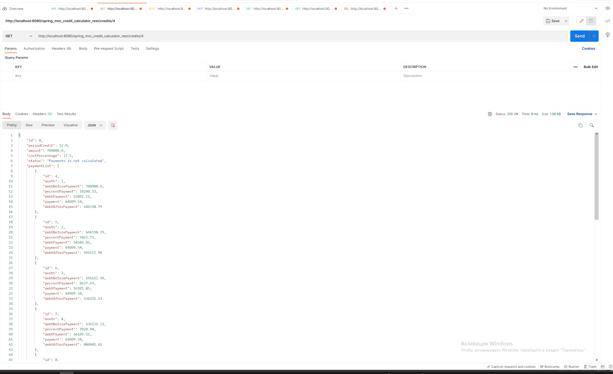

# Annuity Credit Calculator
Technologies:
- REST API
- Spring MVC
- DB - H2 in memory and Spring JDBC
- Connection pool / Transaction control with commons-dbcp2
- GlobalExceptionHandler
- Locale server - Apache Tomcat
- Logging with log4j
- Postman

This application demonstrates a CRUD operations with Credit in DataBase with Spring JDBC and Calculation of the loan schedule

Interface in my Application 

- getAll "/credits" - HTTP.GET

- getId "/credits/{id}" - HTTP.GET

- getId "/credits/{id}" - HTTP.GET, exception handler after try get with id="abc"
  

- add new "/credits" - HTTP.POST, payload in body request with JSON format

- editId "/credits" - HTTP.PUT, payload in body request with JSON format and id for update

- Result after add new and edit credit with id=3 -> - /credits - HTTP.GET

- Calculate schedule payments "/credits/calculate/{id}" - HTTP.GET and get result /credits/{id} - HTTP.GET

- Show payments without credit body "/credits/payments/{id}" - HTTP.GET
- 

- Delete Credit with schedule Payments "/credits/{id}" - HTTP.DELETE. Delete credit with id = 1 and getAll

